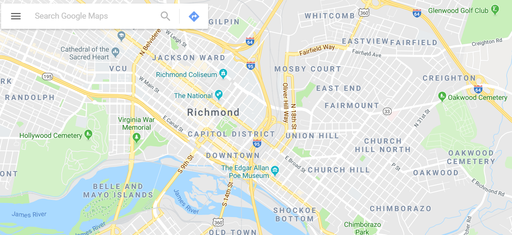
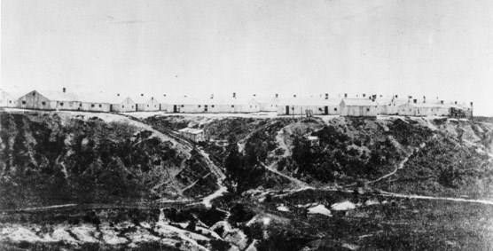

# The History of Church Hill District

[Link to Church Hill wikipedia](https://en.wikipedia.org/wiki/Church_Hill)

Church Hill is in the Eastern District of Richmond when looking at a map, and gets it's name from St. John's Episcopal Church. This is the site where, during the second revolutionary convention, Patrick Henry famously cried:
>Give me Liberty or Give me Death!

The district encompasses the *original* plot of land that defined Richmond City.

## Civil War

During the Civil War, one of the largest hospitals was located in Chimbarozo Park, known as the "Hospital on the Hill"

## Railroad Tunnels and Collapse

In 1925, the single track railroad that was built during the Reconstruction period collapsed. This is known as the Church Hill Railroad and the entrance of it can still be found today. Due to the nature of the collapse, there are properties in Church Hill today that are at risk of damage as the land shifts.

