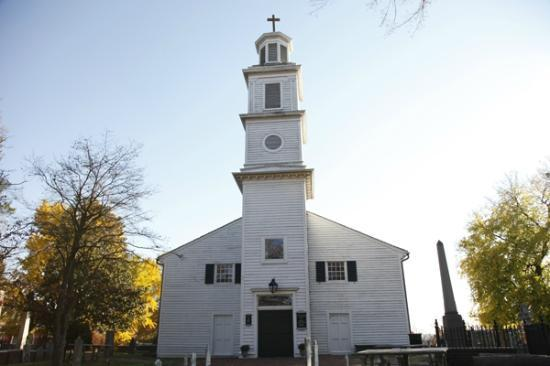

# The History of Church Hill District

[Link to Church Hill wikipedia](https://en.wikipedia.org/wiki/Church_Hill)

Church Hill is in the Eastern District of Richmond when looking at a map, and gets it's name from St. John's Episcopal Church. This is the site where, during the second revolutionary convention, Patrick Henry famously cried:
>Give me Liberty or Give me Death!

The district encompasses the *original* plot of land that defined Richmond City.
There are multiple historical landmarks here, can you hit all of them in one day?

1. St. John's Episcopal Church
  * St. John's Mews
1. Confederate Soldiers and Sailor's Landmark
1. Adam's Double House
1. Elmira Shelton House
1. Honte Maria
