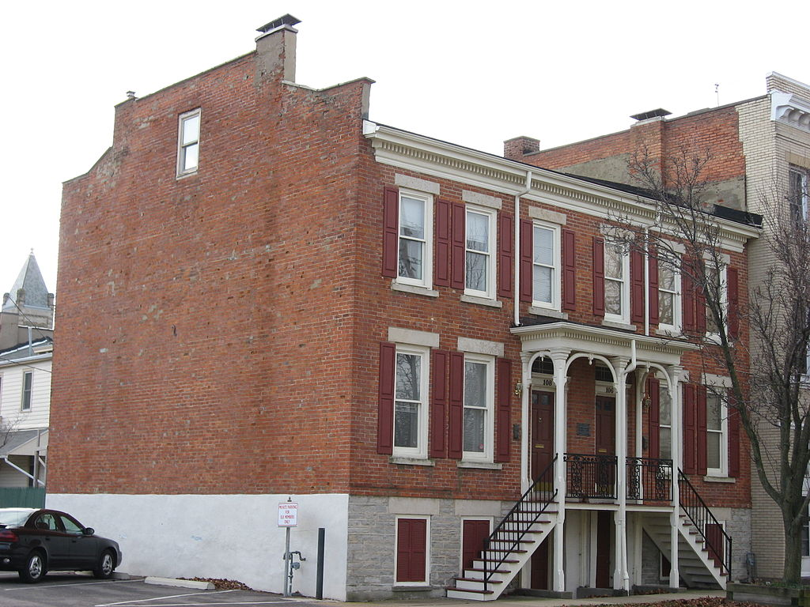

# **Church Hill Landmarks**

Church Hill is a densely populated area when it comes to historical landmarks.

There are multiple historical landmarks here, can you hit all of them in one day?

- [ ] St. John's Episcopal Church
* 
   * St. John's Mews
- [ ] Confederate Soldiers and Sailor's Landmark
* 
- [ ] Adam's Double House
* 
- [ ] Elmira Shelton House
* 
- [ ] Poe Museum
* 

- [ ] Holocaust Museum 
