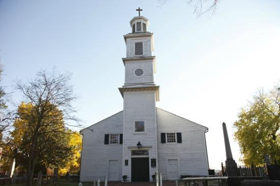

There are multiple historical landmarks here, can you hit all of them in one day?

1. St. John's Episcopal Church
  * St. John's Mews
1. Confederate Soldiers and Sailor's Landmark
1. Adam's Double House
1. Elmira Shelton House
1. Honte Maria
